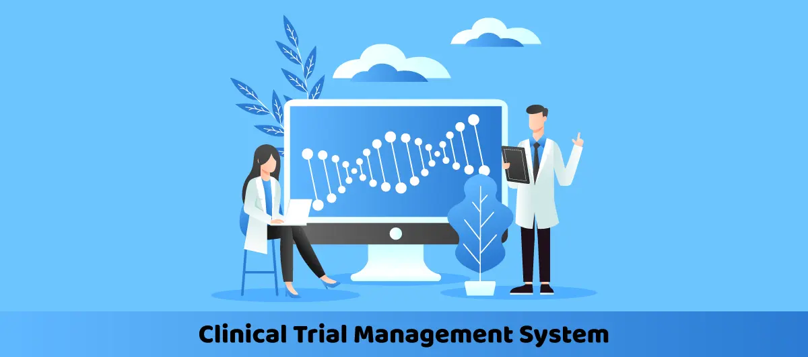

# 
Python WorkShops Session 1 Assignment

### Project Name: **Clinical System Version 1 (Procedural Programming)**
#### Description : Clinical Management System using Dictionaries, Functionts and Procedurals.
**Patient Data**

1. Core Patient Demographics:

    - `Patient ID:` A unique identifier for each patient.
    - `Full Name`
    - `Date Of Birth`
    - `Gender`
    - `Contact Info:`(Phone, Email)
    - `Adress:`(Street, City, State, Zip Code).
    - `Identification:`(National ID Number)
    - `Emergency Contact:` Name, Relation, Phone Number(s). Extremely important.
    - `Primary Care Physician (PCP):` The name of their regular doctor outside your hospital.
2. Medical History & Background:
    - `Known Allergies:` A separate, highlighted section. (e.g., Penicillin, Shellfish, Latex). This is a critical safety field.
    - `Current Medications:` List of all medications, dosages, and frequency. This includes over-the-counter drugs and supplements.
    - `Past Medical History (PMH):` History of major illnesses (e.g., Diabetes, Hypertension, Asthma, Heart Disease, Cancer, Past Surgeries).
    - `Family History:` Illnesses common in immediate family (e.g., heart disease, diabetes, genetic disorders).
    - `Social History:` Smoking status, alcohol use, drug use, occupation, diet, exercise habits.
    - `Insurance Information:` (Vital for billing)
        - Insurance Company Name
        - Policy Number
        - Group Number
        - Policy Holder's Name (if different from patient)
3. Enhanced Visit:
    - `Visit ID`
    - `Chief Complaint:` The patient's reason for the visit in their own words (e.g., "chest pain," "fever for 3 days").
    - `Vital Signs:` (Recorded at every visit)
        - Blood Pressure
        - Heart Rate (Pulse)
        - Respiratory Rate
        - Temperature
        - Height & Weight (to calculate BMI)
        - Oxygen Saturation (SpO2)
    - `Subjective & Objective Notes:` The doctor's detailed notes on symptoms (what the patient says) and signs (what the doctor finds).
    - `Diagnoses:` The doctor's professional conclusions. Should use standardized medical codes (like ICD-10 or ICD-11) for accuracy and billing.
    - `Treatment:`
        - Medications Prescribed (name, dose, instructions, number of refills)
        - Tests Ordered (Lab tests, X-Rays, MRI, etc.)
        - Procedures Performed
        - Referrals to Specialists
        - Patient Education/Instructions given
    - `Progress Notes:` For follow-up visits, notes on how the patient is progressing since the last treatment.
    - `Doctor & Staff Details:` Name, ID, and signature of the attending physician, nurse, and any other involved staff.
4. Billing & Administrative Data:
    - `Fees/Bill Breakdown:`
        - Consultation Fee
        - Procedure Fees (itemized)
        - Lab Test Fees
        - Pharmacy Fees
        - Room Charges (if inpatient)
    - `Payment Status:` (Paid, Pending, Insured, Rejected, Partially Paid)
    - `Appointment Data:`
        - Scheduled Date/Time
        - Type of Appointment (Follow-up, New Patient, Consultation, Procedure)
        - Status (Scheduled, Checked-In, In-Progress, Completed, Cancelled, No-Show)
        - Duration
        - Room/Department assigned

**System Functions:**
1. Add new patient
2. View all patients
3. Update patient info
4. Delete patient
5. Add visit to patient 
6. View patient visits
7. View patient billing
8. Save data
9. Exit